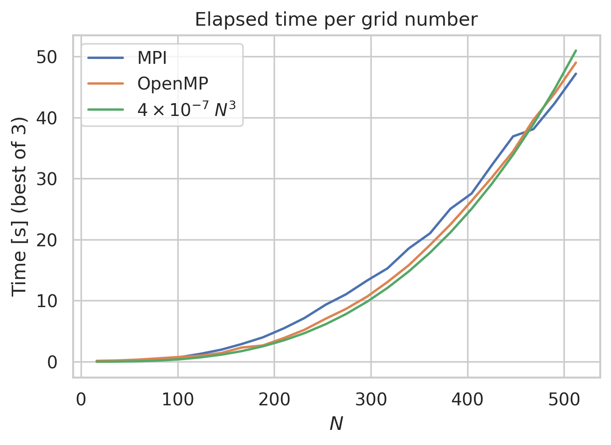

# What is this?
This code computes the 3d density of a set of points in a fast and parallel way.
We implemented two parallel algorithms, one using OpenMP and the other using MPI, the algorithms are provided in the src/ folder


# How to use
Clone the repository
```bash
git clone https://github.com/LetteraUnica/3D-density-estimation.git
```
cd into the src folder
```bash
cd src
```

Compile the code
```bash
sh compile
```

The script will produce 3 executables:  
1. `density_omp.x` Is the OpenMP version of the code  
2. `density_mpi.x` Is the MPI version of the code  
3. `generate_points.x` Script to generate random points, used for test purposes  

These executables, when ran correctly, will produce as output a file named density.bin which is the 3D density matrix in binary format of the point distribution.  

Note: The script will probably trigger some warnings, however these could be safely ignored, they are caused by compiling pragmas without openmp.


# Performance evaluation
## Introduction
The OpenMP code was compiled with GCC version 10.3.0 while the MPI code was compiled with MPICH version 3.3.2

I tested the code using 4 MPI processes for the MPI version and 4 omp threads for the OpenMP version, this number corresponds to the number of physical threads of my CPU, an Intel(R) Core(TM) i5-4690 CPU @ 3.50GHz

## Elapsed time per n points
I fixed the grid number to $N=512$, the radius to $R=1/n^{1/3}$ and I varied the number of points from $10^6$ to $2\times 10^7$


We can see that the elapsed time scales linearly with the number of points, this is expected because we didn't use a brute force approach but we only check the grid points that are close to a certain point. The overall complexity of this algorithm, without counting communication and I/O, is $\Theta(N^3 R^3 n)$, since $R=1/n^{1/3}$ we should have $\Theta(N^3)$ which is a constant. However this doesn't account for the time to read the input file and the time to communicate the points around, which are both operations that scale with $\Theta(n)$. So we improve the speed of the algorithm but it is still linear in the number of points.

## Elapsed time per grid number
I fixed the radius to $R=0.05$, the number of points to $n=2^{20} \approx 10^{6}$ and I varied the grid number from $16$ to $512$



We can see that the elapsed time scales with the cube of the grid number, as expected.
The green line represents a fitted polynomial of degree 3.  
To better see the scaling for high values of $N$ we also plotted the same lines in log-log scale and increased the grid number up to 1024


## Comments on MPI vs OpenMP
In the first benchmark MPI is faster than OpenMP, this could be caused by the fact that the OpenMP program doesn't parallelize the I/O operations while the MPI program does, furthermore the MPI program sorts the data before passing it to the processors, these two optimizations are very noticable for high $N$, low $R$ and high $n_{points}$ which is the case here.  

In the second benchmark the results are very interesting: 
- For $N<100$ the MPI program is slightly better than OpenMP, in this regime the number of cell updates is similar to the number of points, so the pre-sorting of points that the MPI program does is very beneficial.
- For $100 < N < 500$ the OpenMP version is faster, from this point on the number of cell updates is much bigger than the number of points, so the OpenMP code doesn't suffer from skipping the pre-sorting, moreover it manages to achieve better work-sharing among the processors because of tasks, so it performs better than the MPI version.
- For $N>500$ the MPI program returns to be the fastest, in this regime the time spent performing I/O is relevant, for instance when $N=1024$ the density matrix is about $4$ GB, and MPI parallelizes this part while OpenMP doesn't.
